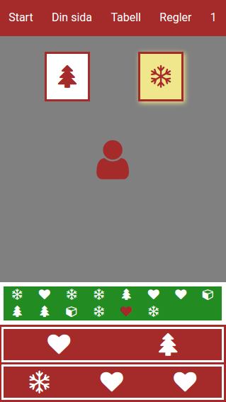

<h1>TomteGO - en variant på julkalender</h1>

Gjord 2016. Har några hårdkodade datum i index.php som behöver ändras för funktion även senare år.
Jobbar främst med cookie-lagring, eftersom jag inte ville tvinga på användare en login, utan bara lite lättsamt nöje.

<h1>Så här fungerar TomteGo</h1>

Under jultomtens väg till julafton ska han hinna med att samla in 24 gåvor. Varje dag ställs tomten inför ett val - två olika gåvor - och det är din uppgift att hjälpa tomten. Genom att klicka på den ena eller andra röstar du på vilken gåva tomten ska ta med sig, och den gåva som får flest röster plockar tomten upp kl 18 på kvällen.

Alla gåvor som tomten plockar med sig ser du i den gröna rutan i nederdelen på skärmen. Där ligger de i tur och ordning, från första december längst till vänster i första raden, till den senast plockade som syns längst till höger i den nedersta raden.

I ditt intresse ligger att du hela tiden har två olika önskelistor, en kort och en lång. Den korta innehåller alltid två gåvor, den långa tre och du ser båda listorna underst på skärmen.
 Om ordningen på någon av dina önskelistor stämmer överens med ordningen i tomtens samlande, dvs om du kan se en av dina önskelistor i tomtens samling, så får du poäng. 
<ul class = 'ruleGifts'>
<li>1 poäng för en kort önskelista</li>
<li>4 poäng för en lång.</li></ul>

Flest poäng när tävlingen är slut vinner.

<h2>Gåvor</h2>

Det finns fyra sorters gåvor:
<ul class = 'ruleGifts'>
<li><i class = 'fa fa-cube fa-2x'></i> Paket </li>
<li><i class = 'fa fa-tree fa-2x'></i> Julgran </li>
<li><i class = 'fa fa-snowflake-o fa-2x'></i> Snöflinga</li>
<li><i class = 'fa fa-heart fa-2x'></i> Hjärta</li>
</ul>

Utöver dessa fyra kan det hända att det ibland syns ett frågetecken istället för en gåvosymbol.
<ul class = 'ruleGifts'>
<li><i class = 'fa fa-question fa-2x'></i> Frågetecken</li>
</ul>

Det innebär att det valet kan vara vilken som av de fyra gåvorna, men vi vet inte förrän klockan blir 18. Då avslöjas vad den gåvan är, om en majoritet har valt den.

<h2>Tider</h2>

Strax efter midnatt skapas dagens valsituation och du kan då se vilka två gåvor tomten har att välja på. Klockan 18 på kvällen räknar tomten alla röster och plockar därefter upp den gåva som flest har röstat på. Skulle det bli precis jämnt så plockar tomten den ena gåvan på måfå.

En positiv sak med årets julkalender är att man kan gå med närsomhelst. När du går med får du nämligen direkt dina önskelistor, och det första som görs då är att tomten stämmer av mot sina tidigare hopsamlade gåvor. Får du in en av listorna visas det på skärmen och du anmodas klicka på texten som talar om detta för att inkassera din poäng.

Därefter får du direkt en ny lista, och den kollas omgående på samma sätt, så den som börjar sent kan mycket väl starta med några poäng direkt. Däremot måste du vara med från början om du vill <strong>påverka</strong> vilken gåva tomten ska välja, och det kan vara värdefullt.

<h2>Menyraden</h2>

I menyn kan du alltid gå till <strong>startsidan</strong>, där du ser tomten och dagens val. Du kan också titta på <strong>Din sida</strong>, där du kan skriva in ditt namn istället för det förvalda samt se vilka olika önskelistor du fått poäng för samt vilka du har just nu (de aktuella syns längst ner i varje förteckning.) 
<strong>Tabell</strong> visar de 100 som har fått flest poäng, och <strong>Regler</strong> visar den här texten. Längst till höger ser du en <strong>siffra</strong> och det är din poäng.
<h2>Cookies</h2>

Webbplatsen använder sig av cookies för att lagra saker som vilken gåva du lagt din röst på, hur dina önskelistor ser ut och vem du är. Genom att vara med i julkalendern antas du acceptera användandet av cookies. Så länge som du använder samma enhet och webbläsare bör du kunna spela som samma användare. Byter du enhet och/eller webbläsare kommer du också att skapa en ny användare.

<h2>Om applikationen</h2>

TomteGo är utvecklad av Hans Andersson på Hulabeck Mediabyrå och är uppbyggd medelst HTML, CSS, PHP, MySQL och Javascript. Den är främst anpassad för mobil användning, vilket kan göra att den ser lite tråkig ut på större skärmar.

Om du vill ge plus eller minus, så hör gärna av dig till <a href = 'mailto:info@hulabeck.se'>info@hulabeck.se</a>.

<h3>Databas</h3>

Följ strukturen i .sql-filen som ligger med i repot.

</section>
